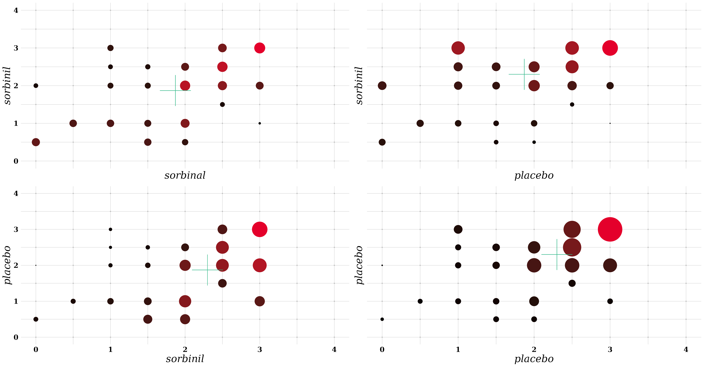

#  vspglm

<!--toc:start-->
- [vspglm](#vspglm)
  - [Description](#description)
  - [Usage](#usage)
  - [Examples](#examples)
  - [Docs](#docs)
  - [Author](#author)
<!--toc:end-->

## Description

All MATLAB Code and examples related to a Semi-Parametric Vector Generalized
Linear Model Solver. The univariate case of this method was first proposed by
Huang (2014) in Joint Estimation of the Mean and Error Distribution in
Generalized Linear Models https://doi.org/10.1080/01621459.2013.824892


_Example of multivariate PMFs for the sorbinil dataset (See Examples)_

More information on this function can be found [here](docs/thesis.pdf)

## Usage

This function uses `MATLABs` Optimization toolbox and `MATLAB >= 2019b`.  

To use the function, clone the repository and add the function to your `MATLABPATH`

```bash
$ git clone https://github.com/gden173/vspglm.git
```

Then open this as your current working directory in `MATLAB` and run the following command in the command window

```matlab
>> addpath('src', '-end')
```

This should add the `vspglm` function to your `MATLABPATH` variable.  This can be checked by running

```
>> matlabpath

		MATLABPATH
		.
		.
		.

	/path/to/vspglm
```
Where the path to the cloned directory should be at the end of the `matlabpath` environment variable.  
This is only temporary, and will have to be rerun every `MATLAB` session.
To run the scripts in the examples directory,  while in the same directory run 

```matlab
>> addpath('examples', '-end')
```

from the command window.


## Examples

<details>
    <summary>
Examples usages can be found in `examples`. The basic usage of the `fit_vspglm`
function can be found by searching some of the documentation.
</summary>

```matlab
>> help fit_vspglm
  vspglm_mmodel = fit_vspglm(formula, tbl,  links)
  fits a vector generalized semi-parametric linear model and stores
  the model output in vspglmmodel
  the function currently takes 3 arguments,
  formula, a string array of string formulas 
  In the formula argument:
             (y1, y2) ~ (x1, x3) -> y1 and y2 share all regression
             coefficients
             (y1, y2) ~ (x1, (x2&0), (0&x3)) 
             -> y1 ~ x1 + x2, y2 ~ x1 + x3
  Responses can also  have a different number of covariates and still 
  share regression coefficients. 
           (y1, y2, y3) ~ (x1,(x2&x2&0), (0&0&x3))
  This means that 
                 y1 ~ 1  + x1  + x2
                 y2 ~ 1  + x1  + x2
                 y3 ~ 1  + x1  + x3    
 
  Where each variable y1, .., yk, x1, .., xp are columns in 
  the table argument tbl. 
  The last argument is then links, a 1 x k cell array of the link
  functions to be used for each model.

>> 
```
once the `src` directory has been added to path. 
</details>

## Docs 

For the technical implementation of the model, 
see the [documentation](docs/thesis.pdf).

## Author

* Gabriel Dennis (@gden173)
